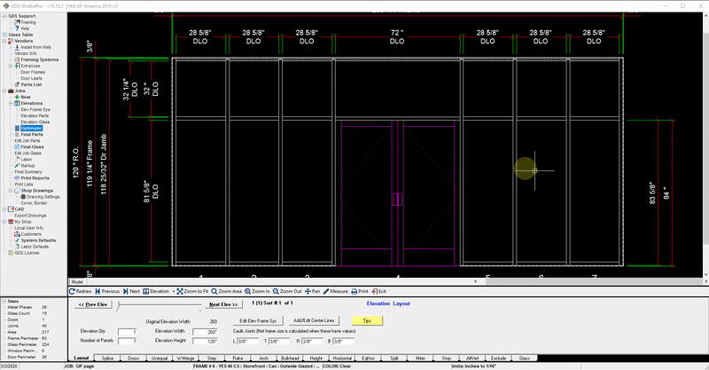

Here you will learn how to edit your framing system configuration to accomodate a Can/Stick system. Once edited, the elevation drawing will reflect the changes made to the framing system configuration.

Everything in this tutorial will take place in the Framing System Configurator Window which can be accessed by clicking the `Edit Elev Frame Sys` button in the layout tab:

---

## Open Framing System Configurator

Everything in this tutorial will take place in the Framing System Configurator Window.

You can either edit the framing system for the **current elevation only**, or you can edit the system in the master list which will apply the changes to **all future jobs and elevations using that system** (as well as the current job if you choose).

If you want the changes to apply **only to the current elevation**, click the `Edit Elev Frame Sys` button In the layout tab. 

If editing this way, you can save a copy of this system to the master framing system list by clicking `Save to Master`.

If you want the change the master framing system which will apply the changes to all future jobs and elevations (and current job if you choose), click `Framing Systems` in the menu on the left, then select the framing system you want to edit:

If after you change the framing system in the master list and wish to use that system in your current job, click `Elevations` in the menu on the left, and select the system by clicking `Change Framing Systems`.

---

## Configuring the Head in a Can System

### Check Your Detail Drawings
To confirm what changes need to be made, you can view the detail drawings by clicking the `Stock Material` tab, and clicking the `view` button under `Head Detail`.

A detail drawing of the head will open.

This particular framing system has a profile of **2”**. In this head detail we can see that the head receptor has a profile of **15/16”**, meaning the head itself has a profile of **1 & 1/16” (2” - 15/16”)**. We’ll need to change those values in the Framing System Configurator.

### Entering Profiles & Vertical Adjustments
First check the `Has Head Receptor` box, then enter the profile of the head receptor **(15/16")**, then enter the profile of the head **(1 & 1/16")**.

Now we need to specify the amount of material to be added to the verticals in the `Add from Bottom` field.

 

Without specifying the amount to add to the verticals, they will be calculated to stop at the bottom of the head receptor (circled in red below), but we know that the verticals need to extend into the head receptor:

Below is what the drawing should look like with the correct amount added to the verticals. We can see that the verticals correctly extend into the head receptor.

In the detail drawing below, we can see from the yellow line that the vertical extends into the head receptor. The red arrow below indicates the top of the vertical.

 

The red circle indicates the distance that the vertical extends into the head receptor. This is the distance we need to calculate and enter into the "Add from Bottom" field. To calculate this value we subtract **15/32"** from **15/16"** and get **15/32"**.

In the detail drawing below, we can see from the yellow line that the vertical extends into the head receptor. The red arrow below indicates the top of the vertical.

Under `Apply adjustments into receptors to`, check the box `Intermediate Verticals` (and "Wall Jambs" if needed). Then we’ll enter **15/32"** in the `Add from bottom` field.

Click `Save and Close`. Now the changes will be shown in the elevation drawing.

---

## Configuring The Sill in a Can System

### Check Your Detail Drawings
To confirm what changes need to be made, you can view the detail drawings by clicking the `Stock Material` tab, and clicking the `view` button under `Sill Detail`.

A detail drawing of the sill will open.

This particular framing system has a profile of **2”**. In this sill detail we can see that the sill can has a profile of **15/16”**, meaning the sill itself has a profile of **1 & 1/16” or (2” - 15/16”)**. We’ll need to change those values in the Framing System Configurator.

### Entering Profiles & Vertical Adjustments
First check the `Has Subsill` box, then enter the profile of the sill can **(15/16")**, then enter the profile of the sill **(1 & 1/16")**.

Now we need to specify the amount of material to be trimmed from the bottoms of the verticals in the `Trim from Bottom` field.

 
Without specifying the amount to trim from the verticals, they will be calculated to extend to the bottom of the sill can (circled in red), but we know that the verticals need to sit on top of the inside of the sill can:

Below is what the drawing should look like with the correct amount added to the verticals. We can see that the verticals correctly trimmed to account for the thickness of the inside of the sill can.

In the detail drawing below, we can see from the yellow line that the vertical should sit on top of the inside of the sill can. The red arrow below indicates the bottom of the vertical.
 

The red circle indicates the distance from the bottom of the frame to the bottom of the vertical. This is the distance **(5/32")** we need to enter into the `Trim from Bottom` field.

We'll enter **5/32"** into the `Trim from Bottom` field. Click `Save & Close`. The changes will now be shown in the drawing.

