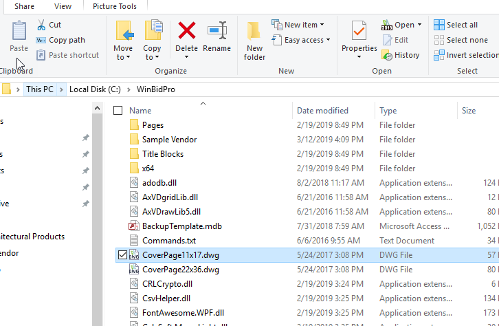

You can manually set the program that opens DWG or DXF files on your PC. This is also called setting the "file association" in Windows. Most often this is done when you install a program that natively opens a specific file type, but in the case of DWG files, this would only be AutoCAD, by AutoDesk. Fortunately, Windows lets us change these associations manually.
​
---

You may see the following message if when you click the CAD link in the WinBidPro menu tree. If so, here is how to get it working properly.

## Choose the program that opens DWG files

1. Open the Windows File Explorer and navigate to Local Disk C: then open the WinBidPro folder.

2. Look for a file called CoverPage11x17.dwg. Double-click on this file and you will see something like the images below.

### In Windows 10

### In Windows 7

3. Click the Select a program from ... option and click OK Then the following window will open.

4. You may only see the WinBidPro CAD program in the list, but if you have something like DraftSight or TurboCAD installed, you can pick one of those other programs.

​
5. Another way to get to one of these windows is to right-click on a DWG file and select Properties, then you can click the Change button like in the Windows 10 image above.

​
6. After setting the "file association" in Windows, the CAD link inside WinBidPro will open the drawing that is on the screen with the CAD program you selected. The same is true if you double-click on any DWG file in the File Explorer.