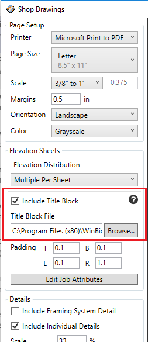
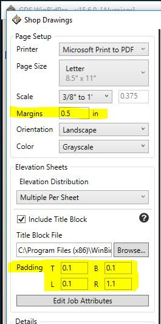
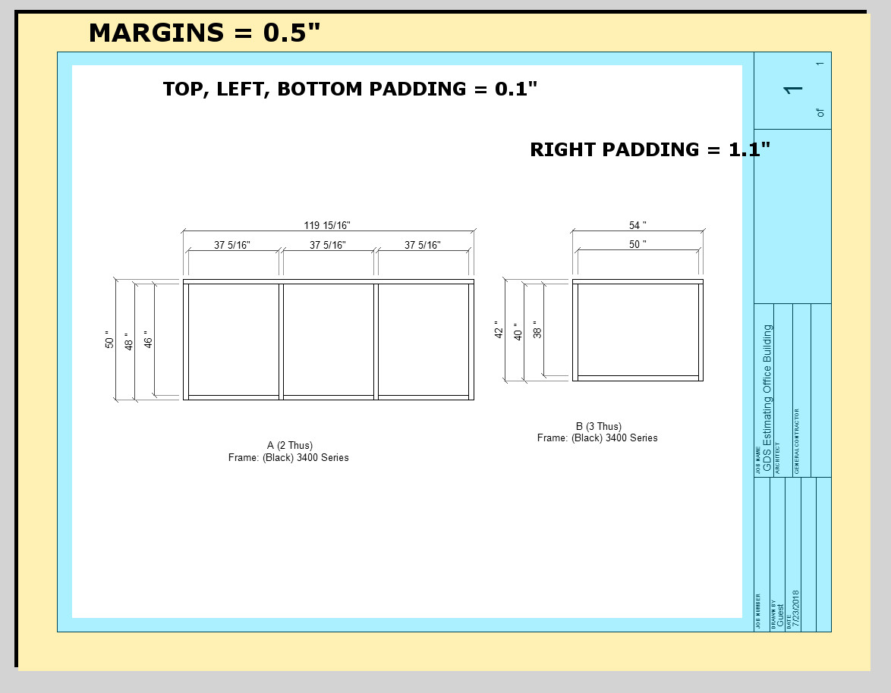
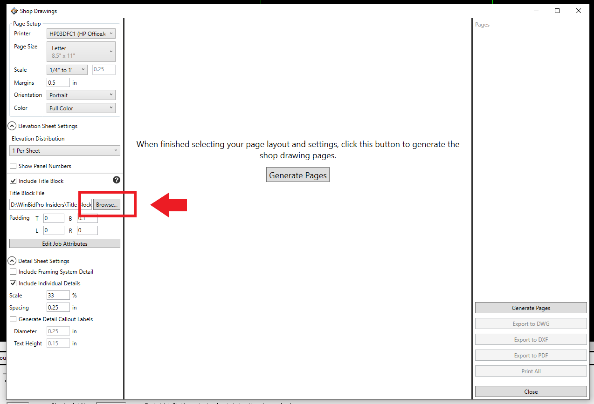
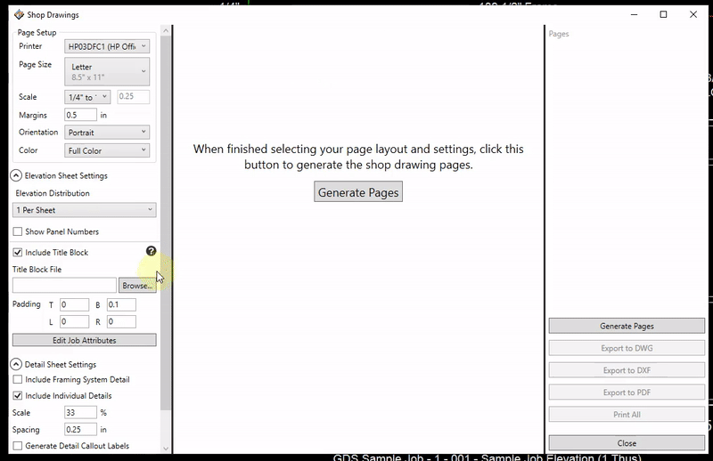
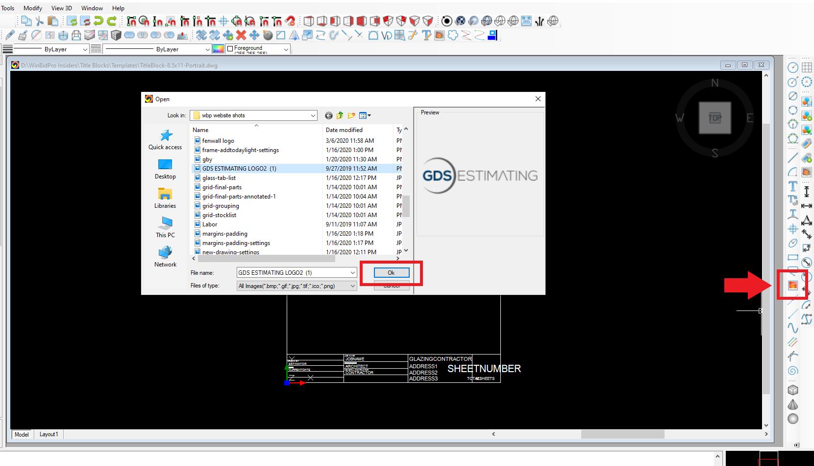
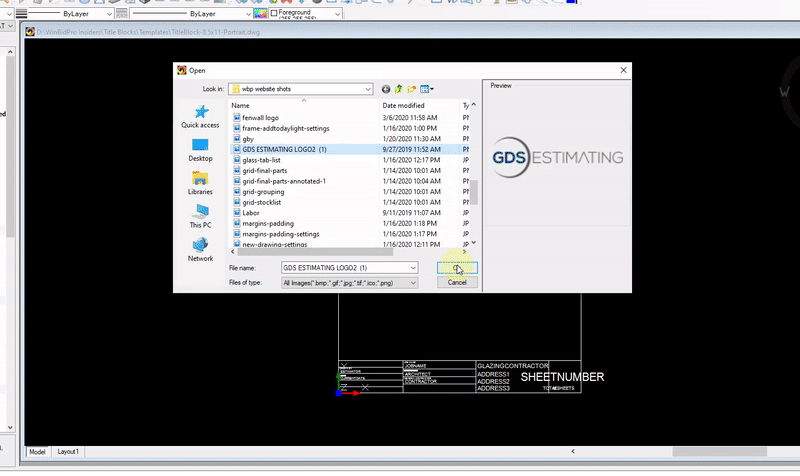
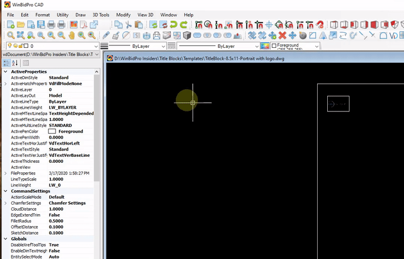
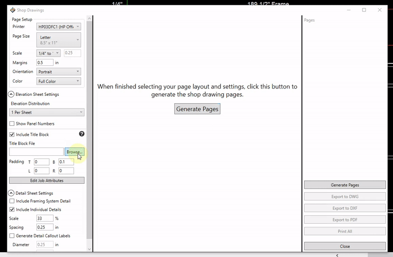
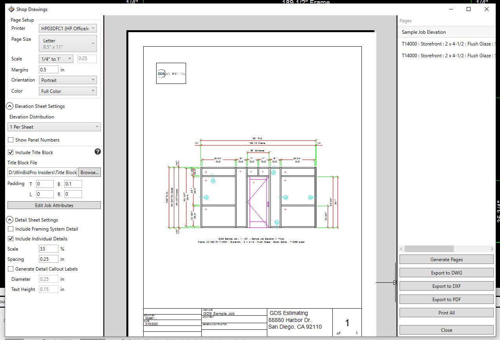

Including title blocks in your shop drawings are a powerful way to make your shop drawings look like they were prepared by a professional CAD shop, but with just a few easy clicks.

---

## Selecting a Title Block

1. Find the `Elevation Sheets` section on the left side of the Shop Drawings window.

2. Make sure the `Include Title Block` checkbox is checked

3. Click the `Browse...` button next to the `Title Block File` text box.

---

## Margins and Padding

#### Example:

**Margins** are the same on all sides. Enter your margin as a decimal number in inches. Entering 0.5 means 1/2". Your Title Block will be placed in the bottom left corner of the page, just inside the margin. See yellow area of the image above.

**Padding** helps adjust for the space taken up by the title block and adding a little extra to pad the elevations from the border of the title block. See the blue space in the image above.

---

## Creating a Title Block for use WinBidPro

To create or modify a Title Block, you need to know a little about using a CAD program. We know how difficult CAD can be, but thankfully Title Blocks tend to be some of the easiest things to draw in CAD. Most of the time Title blocks can be drawn with just simple lines, text, and these things called *Attribute Definitions* (or just *Attributes*).

:::tip
If you don't know CAD, but want a truly profressional and unique Title Block, try finding a company or individual you can pay to make a profressional CAD logo and/or Title Block for you that you can use in WinBidPro.

Alternatively, you can often search for free Title Blocks on Google search (or Google image search) to use for your purposes. You may also have CAD drawings from previous jobs that were done by a third-party professional CAD shop. You should check to be sure there are not legal restrictions preventing you from reusing such a Title Block before adjusting it for use in WinBidPro.
:::

Attributes are text objects that get replaced whenever your title block is inserted into a drawing -- For instance, an attribute called "ARCHITECT" would be where the name of the architect would be placed when WinBidPro generates a shop drawing.

To get started with making a custom title block, we recommend starting with one of samples in the `C:\WinBidPro\Title Blocks` folder. This folder contains several sample Title Block files that you may edit in CAD. There are a few things to note about how Title Blocks are used before you get started:

---

### Things to Know About CAD

#### 1. Title blocks are made for specific page layouts

Title Blocks are inserted at the bottom left corner of the page, just inside the margins. See the image in Margins and Padding above.

:::important
The bottom left corner of the title block drawing should start at the coordinate (0,0) to start just inside the margins on the bottom left of the page.
:::

:::tip
Make the title block the size of the page minus the margins of the page. For an 8.5" x 11" page in landscape orientation with 1/2" margins, your title block should be 10 units wide and 7.5 units tall. This allows 1/2" margin on each side.
:::

#### 2. Save your title blocks files as DXF 2013, DWG 2013

You must Save your title blocks files as DXF 2013, DWG 2013, or lower. Later versions of these file formats may not be supported yet.

#### 3. Title blocks can contain anything

Title blocks can contain anything including your comapany logo, the current date, and notes you want on every drawing. Logos can make a Title Block that much more professional looking.

#### 4. Not all features in modern CAD programs are supported

In particular, WinBidPro does not support multiline attributes that allow dynamically inserted text to flow onto another line when it runs out of space.

#### 5. Predefined Attributes

**The following attribues will automatically be filled in by WinBidPro unless overriden in the Job XAttributes list.**

* ARCHITECT - the name of the architect if already specified in the Cover page screen

* CONTRACTOR - the name of the general contractor

* CURRENTDATE - the current date in a format like 7/13/2018

* ESTIMATOR - the name of the current user

* GLAZINGCONTRACTOR - the name of your company if specified in the My Shop screen

* JOBNAME - the name of the job

* SHEETNUMBER - the current page number of the elevation sheets

* TOTALSHEETS - the total number of elevation sheets

**The following attributes are supported when elevation pages are set to contain only 1 elevation per page**

* ELEVATIONNAME - the name of the elevation.

:::tip
Some users like to name their elevation by the assigned code from the architect such as A or D3. Then this code may be automatically added to the shop drawing through a title block attribute set to ELEVATIONNAME.
:::

* ELEVATIONSORT - the elevation assigned sort number.

---

### Adding your company logo to a title block

First you will have to open the title block template you wish to edit in a CAD program. We will use WinBidPro CAD in this tutorial.

1. In the Shop Drawings window, click `Browse` next to `Title Block File` field

2. Open the Templates folder

3. Select which title block template you wish to edit, and right click it.

4. mouse over `Open with` and select WinBidPro CAD

Once the title block is opened in WinBidPro CAD:

1. Click the `Image` button in the right toolbar.

2. Select the file you will use for your logo.

3. Click `Ok`.

Position your logo where you want by dragging it.

Click `File > Save as`, and name the new template something you will recognize.

Back in the Shop Drawings window in WinBidPro, we can now choose the new title block template we just created.

1. Click `Browse`

2. Select the new template

3. Click `Generate Pages`.

Your logo will now be shown on all shop drawings that use the template you created.

​