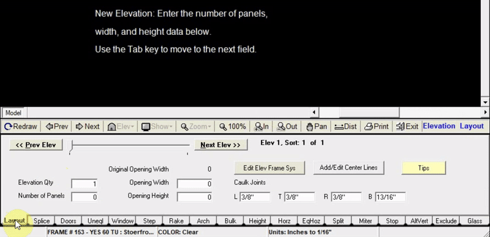
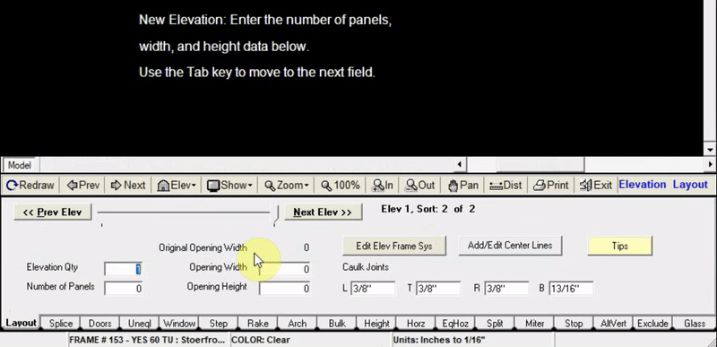
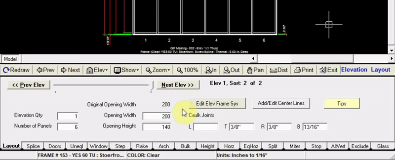
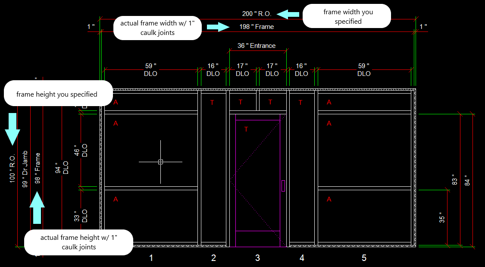
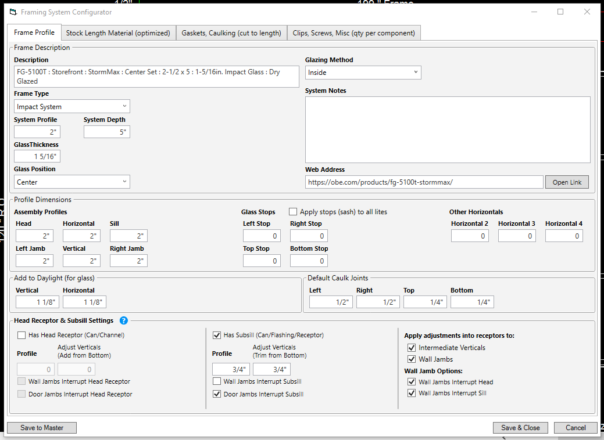
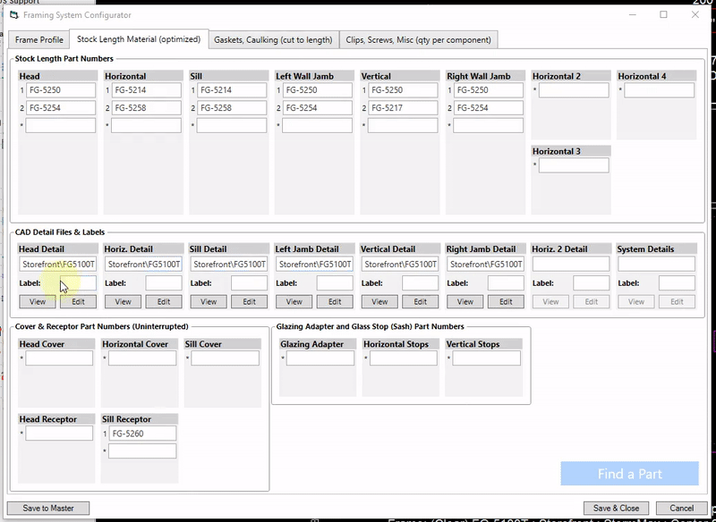
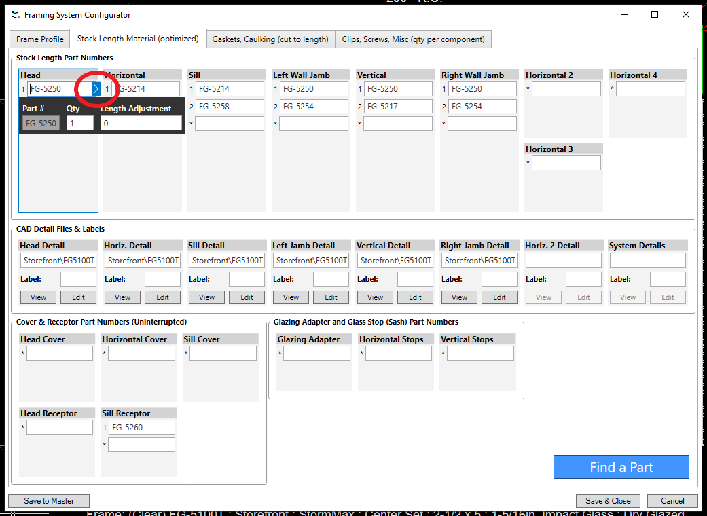
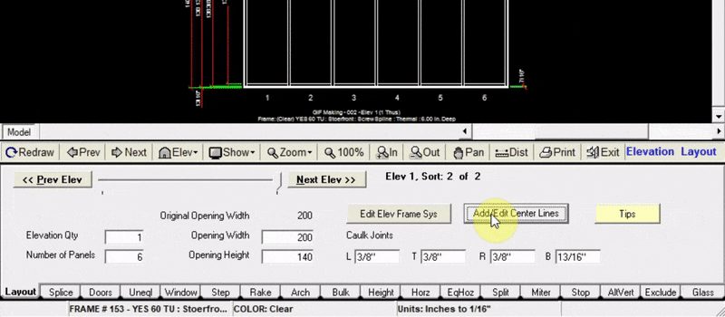

In the Layout tab you are able to:
* Create new elevations
* Navigate through all of your elevations within a job
* Edit each elevation’s framing system
* Add & edit caulk joints
* Add & edit center lines

---

### Creating a New Elevation
A new elevation can be created in two ways:
Clicking the small `Elev` button above the Layout tab and selecting “New Elevation”
Or Clicking the `Next Elev >>` button at the top of the Layout tab.
You will then be asked to name your new elevation.

Once your elevation is named, and a framing system is selected, you will need to specify the number of panels your elevation will have, as well as it’s width and height. While entering your dimensions, you can hit the "Tab" key to get to the next box. Hitting tab after your last entry will draw your elevation in the drawing window.

---

### Adding Caulk Joints
To add caulk joints, input their thickness **in inches** in each of the four fields labeled 
* `L` (Left)
* `T` (Top)
* `R` (Right)
* `B` (Bottom)

Once entered you will be able to see the caulk joints on your elevation in the drawing window.

:::note
adding caulk joints changes the height and width of the frame, so that the frame + caulk joints will fit into the rough opening.

For example, if before adding caulk joints your opening width is 200", your frame width would be 200". Adding 1" caulk joints on on the left and right will make the actual frame width 198".

:::

:::note 
Another thing that caulk joints will affect is the height at which horizontals are added.

When specifying "Height from Bottom" at which your horizontal will be added, this is the distance from the bottom of the caulk joint, NOT the bottom of the frame itself. The drawing however, will display the horizontal height from the bottom of the frame itself.

For example with a 1" caulk joint, adding a horizontal at 36" height from bottom, the actual drawing will show the horizontal at a height of 35".
:::

---

### Framing System Configuration
By clicking the `Edit Elev Frame Sys` button you can make changes to any aspect of the framing system of the current elevation.

In the `Frame Profile` tab, you can edit the system's name, it's profiles, depth, glass thickness, add to D.L.O., etc.

In the `Stock Length Material` tab, you can edit, add, or remove stock length parts, and view assembly details.

You can adjust the quantity of any part and add length adjustments by clicking the blue arrow next to the part number

The `Gaskets, Caulking`, and `Clips, Screws, Misc` tabs behave in the same way as the "Stock Length Material" tab, so you can also adjust quantities and add length adjustments.

For more detailed explanation of configuring framing systems, [click here](https://www.gdsestimating.com/framing-systems "Framing System Training Videos") to watch our framing system training videos.

---

### Adding a Center Line

Adding a center line allows you to specify the distance of a selected vertical from the left jamb. In WinBidPro, verticals are numbered 0,1,2,3...etc., (left jamb being "0").

To add a centerline:

1. Click “Add/Edit Center Lines”.
2. Select the vertical that you want to be a specific distance from the left wall.
3. Input the distance in inches that the vertical will be from the left wall. 
4. Click “Add”, then click “Done”. Your elevation is now updated with the new center line.

:::note
adding a center line does not change the overall width of your elevation. All panels will be equalized to accommodate the new center line
:::

:::note
If you lock your verticals at a certain position using centerlines, keep in mind you won’t be able to adjust your panel widths later using the `Uneql` tab. If you are trying to change panel widths, consider using the `Uneql` tab instead. 
:::