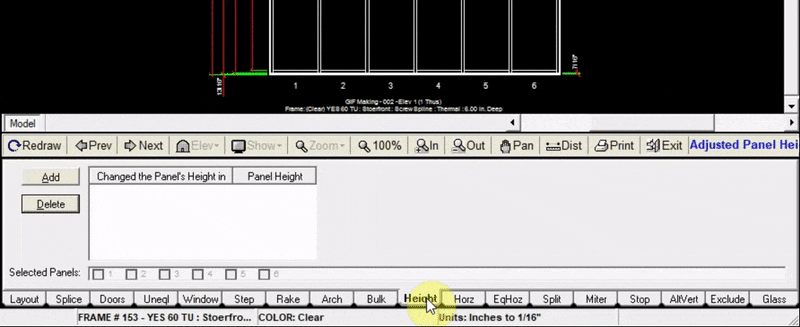

The height tab allows you to specify a new height of the tops of one or multiple panels.

---

### Changing the Height of a Panel (or Panels)

1. Click the `Add` button at the top left of the height tab
2. Click `Selected Panels` and choose the panels you will change the height of
3. Input the new height (in inches) of the panel tops
4. Click `Add to Drawing`. Now your drawing will be updated with the new panel heights

:::note
If you are looking to place equal cascading heights to multiple panels, use the “Step” tab instead.
:::