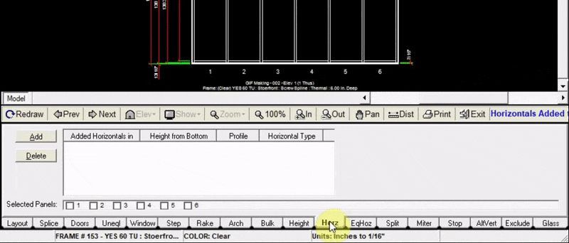
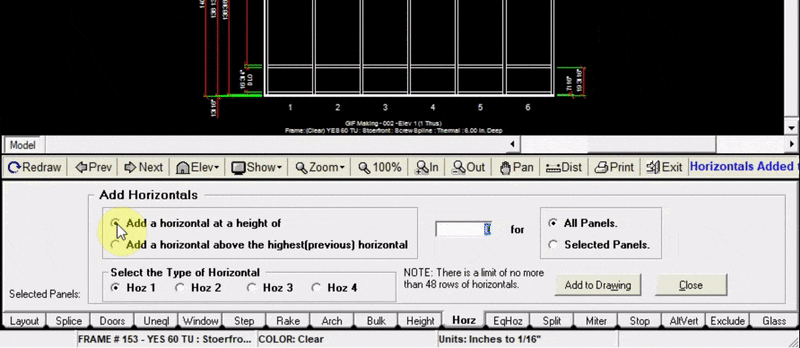

The Horz tab allows you to add individual horizontals to one or multiple panels.

---

### Adding a Horizontal

1. Click `Add` at the top left of the horz tab
2. Select `Add a horizontal at a height of`
3. Input the height (in inches) at which your horizontal will be
4. Choose whether to add the horizontal to all panels or certain panels.
5. Click `Add to Drawing`. Now your drawing will be updated with the new horizontal

---

### Adding a Horizontal above an existing Horizontal

1. Click `Add` at the top left of the horz tab
2. Select `Add a horizontal above the highest (previous) horizontal`
3. Input the height (in inches) above the previous horizontal that your new horizontal will be
4. Choose whether to add the horizontal to all panels or certain panels.
5. Click `Add to Drawing`. Now your drawing will be updated with the new horizontal

