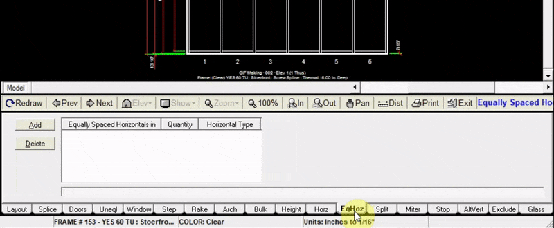

The EqHoz tab allows you to add a number of equally spaced horizontals to your elevation to one or multiple panels.

---

### Adding Equally Spaced Horizontals

1. Click `Add` at the top left of the EqHoz tab
2. Input the quantity of horizontals that you will add
3. Choose whether to add the horizontals to all panels or certain panels.
4. Click `Add to Drawing`. Now your drawing will be updated with the new horizontals

