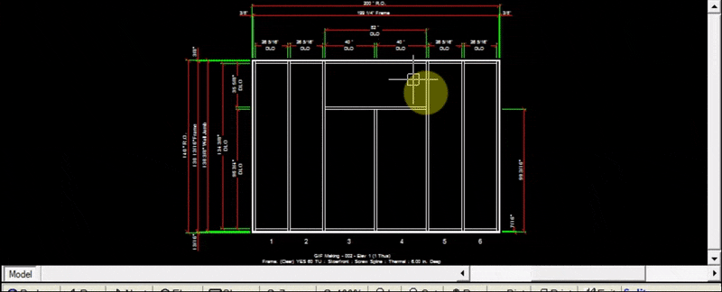

The Split tab allows you to split a window or transom by adding one or more equally spaced vertical mullions within the window.

---

### Adding Splits to a Window

1. Click `Add` at the top left of the split tab
2. Input the quantity of splits to be added
3. Input the number of the panels containing the window or transom
4. Input the height of the bottom of the window
5. Input the height of the top of the window
6. Click `Add to Drawing`. Now your drawing will be updated with the new window splits

