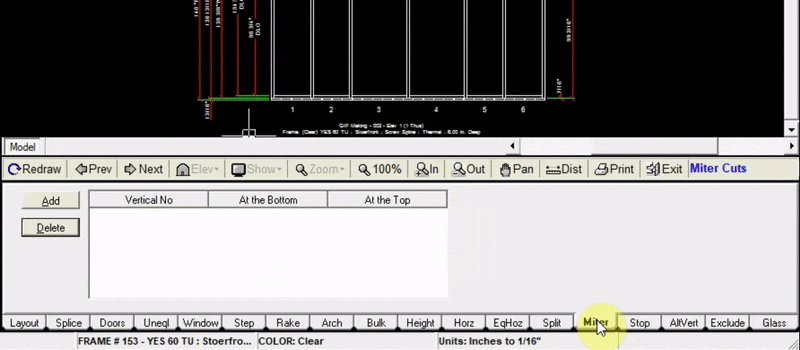

The Miter tab allows you to add mitered corners to where your wall jambs meet your head and sill.

---

### Adding Miters

1. Click `Add` at the top left of the miter tab
2. Input the vertical number of your jamb (left jamb is vertical #0). Miter can only be added to one vertical at a time.
3. Choose whether to add a miter to the top or bottom of the vertical (or both)
4. Click `Add to Drawing`. Now your drawing will be updated with your new miters.

