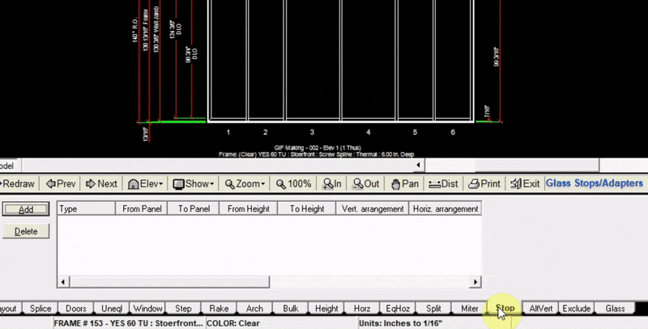
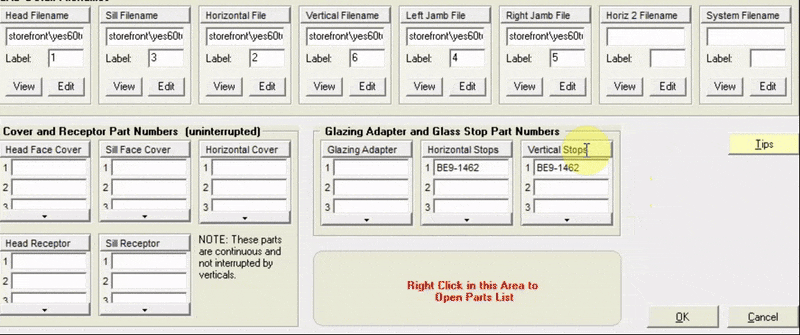
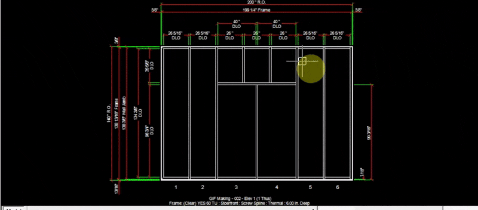

The Stop tab allows you to add glass stops to any glass opening. In this example we add glass stops to the windows in panels 3 & 4. Before adding a glass stop, a part number and profile must be specified in the `Edit Elevation Frame System` window.

---

### Adding Glass Stop Part Numbers

1. Head over to the Layout tab and click `Edit Elev Frame Sys`
2. At the top of the pop-up window, click the `Stock Length Material` tab
3. In the section titled `Glazing Adapter and Glass Stop Part Numbers`, Click the field under the label `Horizontal Stops` or `Vertical Stops`.
4. Right click the area with red text saying `Right Click this Area to Open Parts List`
5. In the Parts List, search for the glass stop part number you will be using
6. Click `Insert Part`. (In this example we copied and pasted the same part number for the horizontal stop into the `Vertical Stop` field).

---

### Adding Glass Stop Profiles
Before glass stops are visible in the drawing, we must specify the profile width of the glass stops.

1. At the top of the `Edit Elev Frame Sys` window, click the `Frame Profile` tab
2. In the Section titled `Glass Stops`, input the profiles (in inches) of the left, right, top, and bottom glass stops
3. Click `OK` at the bottom right of the window.

---

### Adding Glass Stops to the Drawing

1. Now that we have chosen which part numbers to use for the glass stops, and specified their profiles, we can add the glass stops to the drawing.
2. Click `Add` at the top right of the stop tabInput the panels in which your glass stops will be
3. Input the height at which your glass stops will begin (in this example they will start at the bottom of the window we added to panels 3 & 4)
4. Input the height at which your glass stops will end (top of the window in this example)
5. In this example we chose to add glass stops on all sides of the windows (left, right, top and bottom)
6. Click `Add to Drawing`. Now your drawing will be updated with the new glass stops. They will be visible as purple lines.

