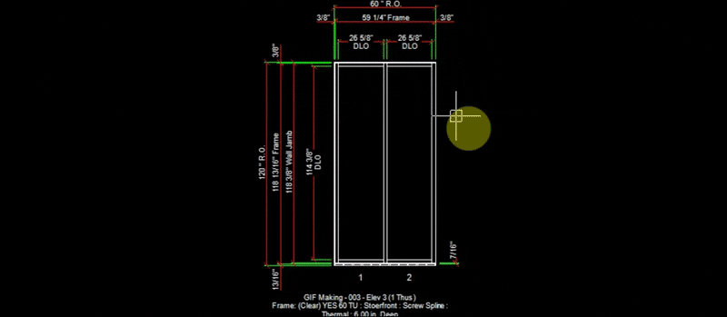
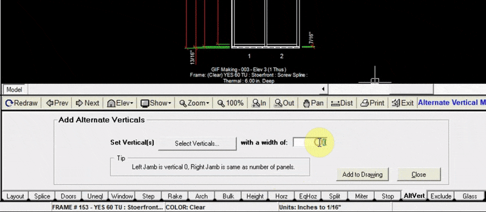

The Alternate Vertical tab allows you to replace an individual jamb or vertical mullion with another one such as a corner mullion. Using the AltVert tab is the first step in creating a corner which connects two elevations.

---

### Selecting the Jamb/Vertical to Replace

1. Click `Add` at the top left of the AltVert tab
2. Click `Select Verticals`
3. In the pop-up window, choose which vertical to replace. (In this example will be replacing the right jamb)
4. Input the width (in inches) of the corner mullion you will be using

---

### Selecting the Part Number of Your New Mullion & Adding it to the Drawing
Before adding the new corner mullion to the drawing, a part number must be specified.

1. Click `Add to Drawing`
2. In the pop-up window, right click the area that says `Right Click in this Area to Open Parts List`
3. From the parts list, select the corner mullion that you will be using, then click `Insert Part`. 
:::note
you can filter the parts list by typing ‘corner’ into the description field
:::
4. Click “OK”. Now your drawing will be updated with the new corner mullion

