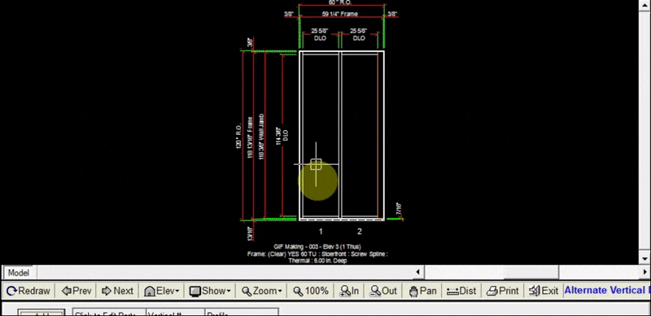
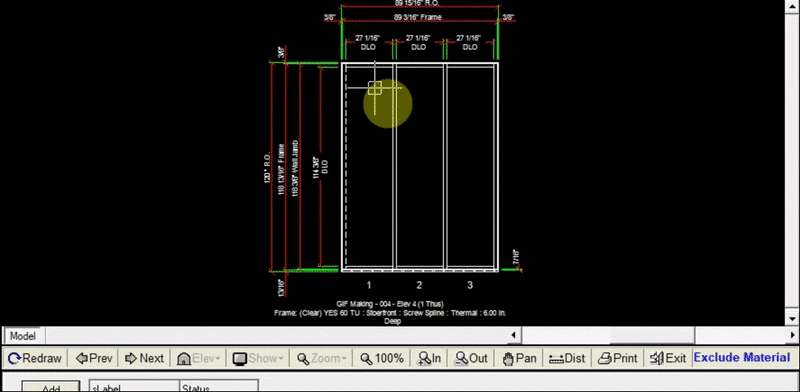

The Exclude tab allows you to exclude a jamb/vertical from an elevation. Doing this is the second step in creating a corner joining two elevations. Since the corner mullion was added to the previous elevation, you won’t need to add the same corner mullion to this elevation.

---

### Excluding a Jamb/Vertical

1. Create the elevation that will be joined to the previous elevation with the corner mullion you just added.
2. Click `Add` at the top left of the exclude tab
3. On the drawing, click on the jamb/vertical you will be excluding
4. Click `Update Drawing`. You will notice the jamb/vertical you excluded is now shown by with dashed line.

---

### Changing the Profile of the Excluded Jamb/Vertical
To get the most accurate estimate of the new corner, the profile of the excluded jamb/vertical should match the profile of the corner mullion selected in the previous elevation.

1. Click the Layout tab
2. Click `Edit Elev Frame Sys`
3. Under the section titled `Profile Dimensions`, input the profile of the corner mullion into the field corresponding to the jamb/vertical you just excluded. (Left jamb in this case)
4. Click `OK`. Now your drawing will show the updated profile of the excluded jamb/vertical.

