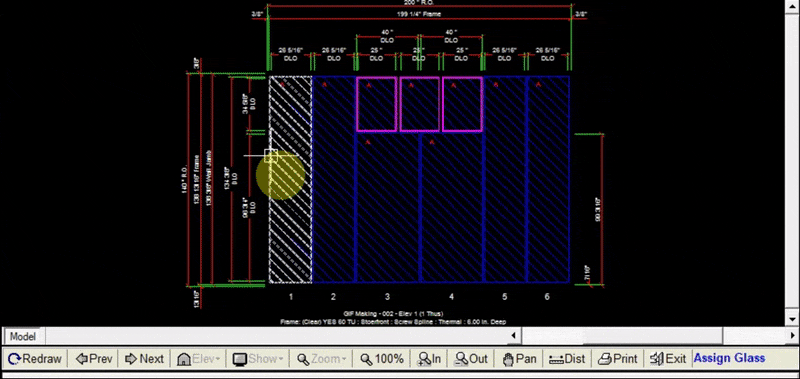

The Glass tab allows you to change the type of glass used in each panel. You can change the type of glass cdeither by row, by lite, or by elevation. In this example we add tempered glass to several panels.

---

Changing the Glass Type

1. In the glass tab, under the section at the far left titled `Action`, we selected `Add` to add a new type of glass
2. In the next section over, titled `Apply Glass`, we selected `by Lite`, to change the glass type of specific lites.
3. Select the glass you would like to use in the menu. 
    -  You are able to filter results by using the `Description`, `Color`, `Type` fields, etc… 
    - The `Show Label` Column allows you to customize the glass label shown on each lite in the drawing window. For the glass we selected, we changed the label to say `Tempered`.
4. Click on the lites/rows you would like to apply the new glass to.

