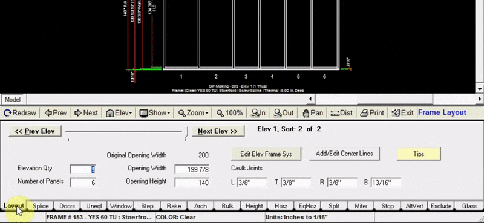

The splice tab is a useful tool when estimating elevations that are taller than the stock lengths of your verticals and jambs. WinBidPro allows you to enter up to 10 splices in your verticals. Adding a splice location will be applied to all verticals in the elevation.

---

### Add a Splice

1. Enter the height (in inches) for each splice location. All points are measured from the ground (0 inches).
2. Click `Redraw`. You will now be able to see your new splice in the drawing window

:::note
No gap is calculated for the specified splices
:::