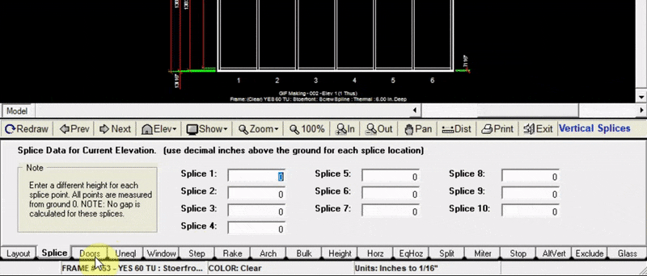
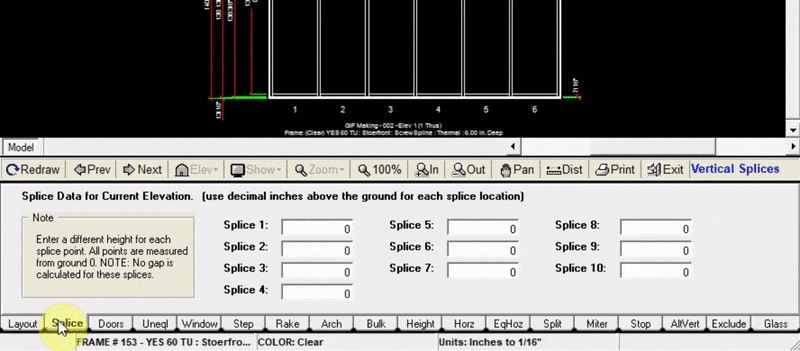

In the doors tab you can:

* Add a complete entrance (frame and leaf). These are pre-configured shortcuts to selected door frames and door leafs.
* Separately add a door frame and door leaf

---

### Adding a Complete Entrance

1. Click `Add Entrance` on the left side of the doors tab.
2. Specify the panel where you want to place your door.
3. Click `Add Entrance` on the right side of the doors tab.
4. Choose the entrance you want to use from the pop-up window (in this window you can also edit or change the frame or leaf used in the entrance shortcut).
5. Click the `Select` button at the bottom right of the pop-up window. Now your drawing will be updated with the new entrance.

---

### Adding a Door Frame
To add a door frame without a door leaf:

1. Click `Add Entrance` on the left side of the doors tab.
2. Specify the panel where you want to place your door frame.
3. Click `Add Door Frame`.
4. Select the door frame you will use from the pop-up window.
5. Click `Select` at the bottom right of the pop-up window. Now your drawing will be updated with the new door frame.

:::note
make sure to select a door frame that matches the profile of your elevation frame.
:::

---

### Adding a Door Leaf
To add a door leaf after you’ve added a door frame

1. Input the panel number containing the door frame, then click `Add Door Leaf`.
2. Select a door leaf from the pop-up window.
3. Click `Select` at the bottom right of the pop-up window. Now your drawing will be updated with the new door leaf.
