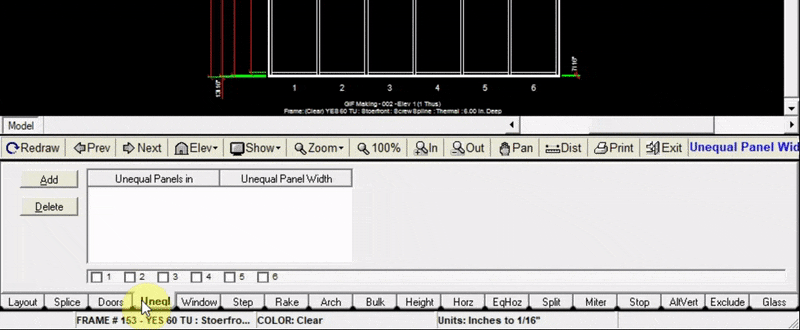

The Unequal Panels tab allows you to change the width of a single or multiple panels (not affecting the overall width of the elevation. The overall frame width will only be affected if the width of every panel is changed).

In this example, panels 3 & 4 were changed to have a width of 40 inches each. The remaining panels will be equalized to keep the overall width of the elevation the same.

---

### Adding Unequal Panels

1. Click the `Add` button at the top left of the Unequal tab
2. Click `Select Panels`
3. Choose which panels that you want to have a specified width
4. Input the width of your unequal panels (in inches)
5. Click `Add to Drawing`. Now your drawing will be updated with the new unequal panels

:::note 
you do not need to set the width of a panel where a door will be placed, adding the door frame will adjust that panel automatically
:::