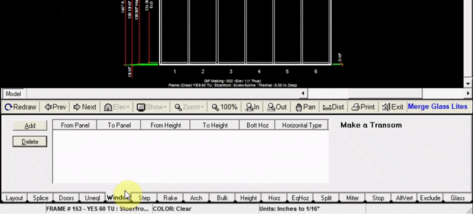

The Window Merge tab allows you to merge multiple lites to create a single opening at a desired height.

---

### Adding a Window or Transom across multiple lites

1. Click the `Add` button at the top left of the w-merge tab
2. Input the panel numbers in which your window will be (In this example we added a window from panel 1 to panel 2).
3. Input the height at which the window will begin (bottom of window)
4. Input the height at which the window will end (top of window)
5. Click `Add to Drawing`. Now your drawing will be updated with the new window or transom

:::note
The W-Merge tab does not place operable windows in the specified locations.
:::