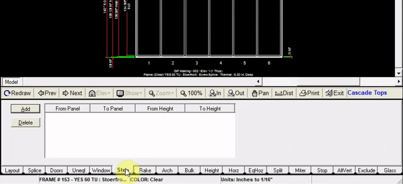

The Step tab allows you to add a step or cascade top from one panel to another. The height of each panel will be adjusted evenly based on the height of the first and last panel selected.

If you want to adjust the height of one panel only, use the `Height` tab instead.

---

### Adding a Step Up

1. Click the `Add` button at the top left of the step tab
2. Input the panel numbers in which your step up will be (In this example we added a step up from panel 1 to panel 3).
3. Input the height at which your step will start (top of lowest step)
4. Input the height at which your step will end (top of highest step)
5. Click `Add to Drawing`. Now your drawing will be updated with the cascaded top.

