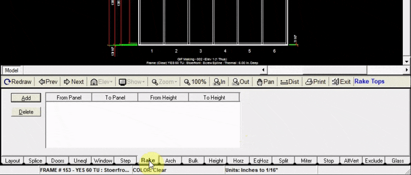

The Rake tab allows you to add a rake top (slope up or down) from one panel to another.

---

### Adding a Rake Top

1. Click the `Add` button at the top left of the rake tab
2. Input the panel numbers in which your rake top will be 
    :::note
     to add a rake top to only one panel, input from panel `1` to panel `1`. In this example we added a rake top from panel 5 to panel 6.
3. Input the height at which your rake top will begin
4. Input the height at which your rake top will end
5. Click `Add to Drawing`. Now your drawing will be updated with the new rake top.

:::note
Always add your raked top from left to right.
:::