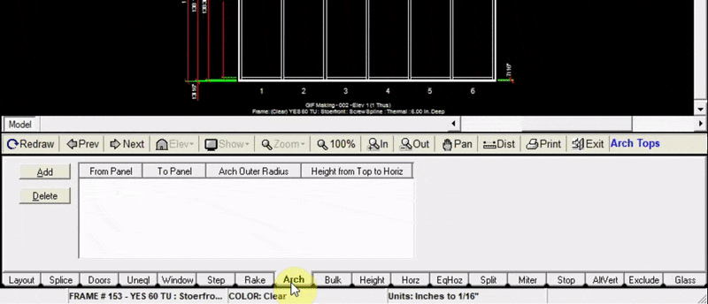

The arch tab allows you to add an arched top from one panel to another. The option is available to stop the verticals at the original head, or extend them up to the arched top.

---

### Adding an Arched Top

1. Click the `Add` button at the top left of the arch tab
2. Input the panel numbers in which your arched top will be placed 
    :::note 
    to add an arched top to only one panel, input “from panel 1 to panel 1”. In this example we added an arched top across the whole elevation, from panel 1 to panel 6.
3. Specify the size of the arched top either by inputting its 
    a. Outer radius (in inches) 
    b. Or its height (in inches) above the top of the original head.
4. Check the box to the right to have the verticals stop at the original head, or leave it unchecked to extend the verticals up to the arched top.
5. Click `Add to Drawing`. Now your drawing will be updated with the new arched top.

:::note
You will need to change your Opening Height in the “Layout” tab to be at the starting height, lowest point of the arch, then add the height for the top of the arch.

For example, if your overall elevation height is 100 inches, and you need an arch top 20 inches above the original header, you will need to change your opening height to 80 inches, then add an arch 20 inches above that for an overall height of 100 inches.
:::