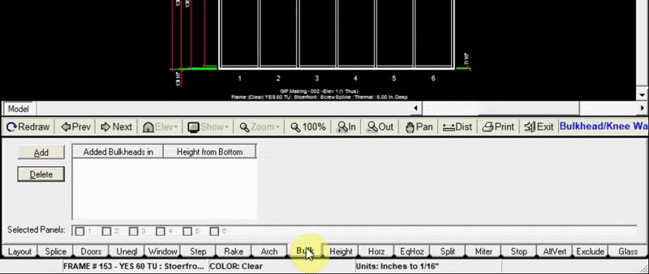

The Bulk tab allows you to raise the selected panel or panels to a desired height to accommodate a bulkhead or knee wall.

---

### Adding a Bulkhead

1. Click the `Add` button at the top left of the bulk tab
2. Input the height (in inches) that your bulkhead will be
3. Select `All Panels` to apply the bulkhead to all panels, or select `Selected Panels` to choose which panels to apply the bulkhead to.
4. In the pop-up window, choose which panels to apply the bulkhead to
5. Click `Add to Drawing`. Now your drawing will be updated with the new bulkhead

