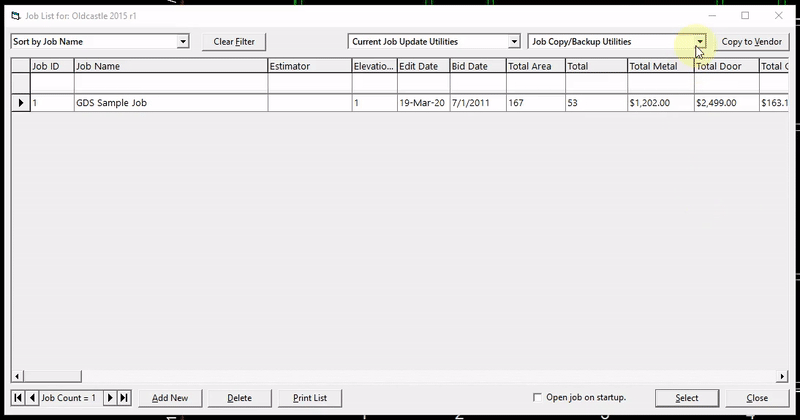
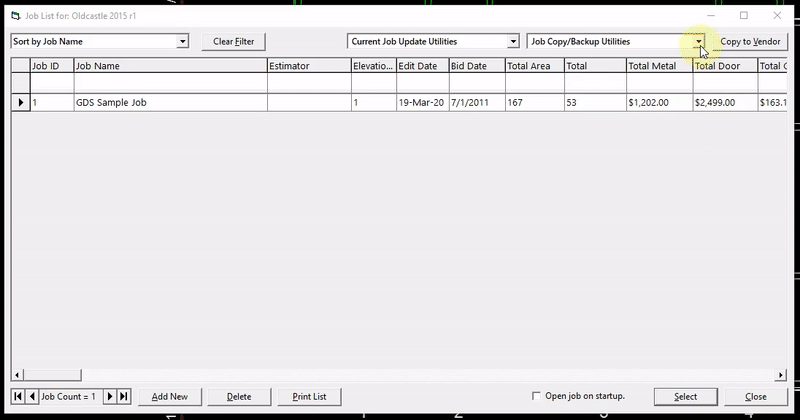

Jobs and catalogs are stored in each vendor catalog's database file (.mdb). A job can be shared by sending the database file of any vendor to another user.

## To Share a Catalog:
1. Find the WinBidPro folder on your hard drive.
2. Naviagate to WinBidPro > Vendor Catalogs.
3. Send either the entire folder (ex. Arcadia; YKK; Tubelite) or the database file within the folder.

Jobs can now be shared with the import/export functions in the job window.

## To Export a Job:
1. In the `Jobs` window, click the dropdown arrow in the top right corner.
2. Select `Export/Backup Current Job to File`, then name the file and choose a location to save it to.
3. It will be saved as a `.wbpj` file which you can send to another user for importing.

## To Import a Job:
1. In the `Jobs` window, click the dropdown arrow in the top right corner.
2. Select `Import/Restore Job(s)`, then choose a .wbpj file to import.

