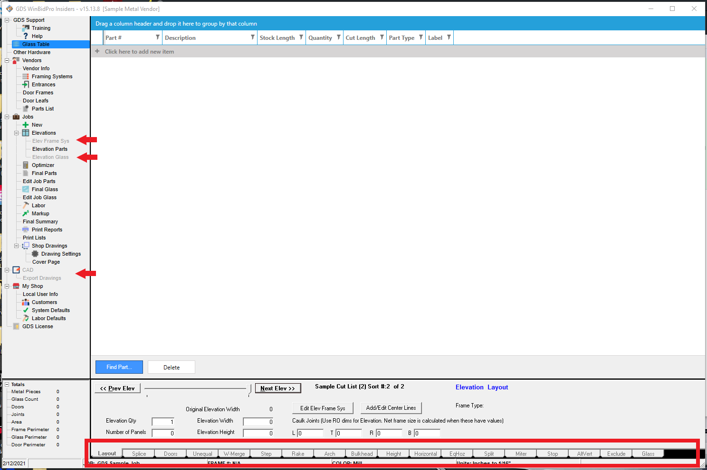
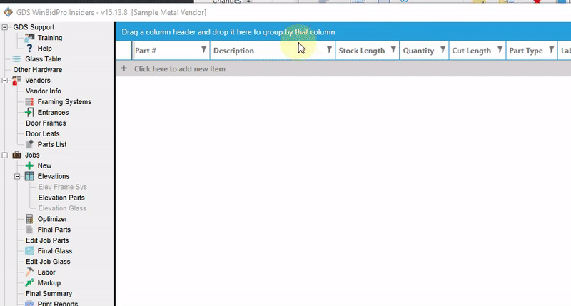

As of version 15.13.7 we've added a Basic Cut List feature to WinBidPro replacing EZ-Cutlist and CloudGDS. 

With the Basic Cut List feature, you can easily create a cutlist-only job without any elevation drawings. You can also easily add a basic cutlist to a job with elevation drawings.

## Creating a Basic Cut List

Now when you try to create a new elevation, a pop-up window will appear allowing you to create an elevation or a basic cut list. Click `Basic Cut List`, and enter a description and elevation code then click `Create`.

Instead of an elevation in the drawing window, you'll see a cut list.

When a Basic Cut List is selected, you'll notice that some features related to elevation drawings are grayed-out and unclickable (i.e. the drawing tabs at the bottom of the screen and certain items in the menu tree)

---

## Adding Parts to Your Cut List

**If you already know which part numbers you will be adding to your cut list**, click `click here to add a new item`. 

As you type the part number, a drop-down list of suggestions will appear. Either select a part from the drop-down list or type the entire part number.

Enter a quantity and cut length.

:::tip
If you need multiple cut lengths of the same part number, hitting the enter or tab keys will duplicate the selected part. Instead of having to enter the same part number multiple times, you can duplicate a part and change the quantity or cut length for each.
:::

**If you want to browse the parts list or add a new part**, click `Find Part...`. 

The Parts List will open and you can either browse for a part or add a new part.

