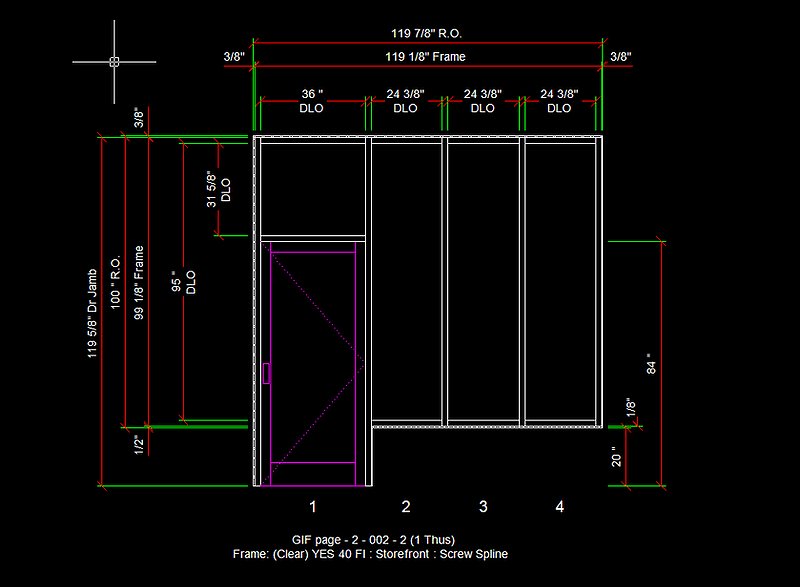
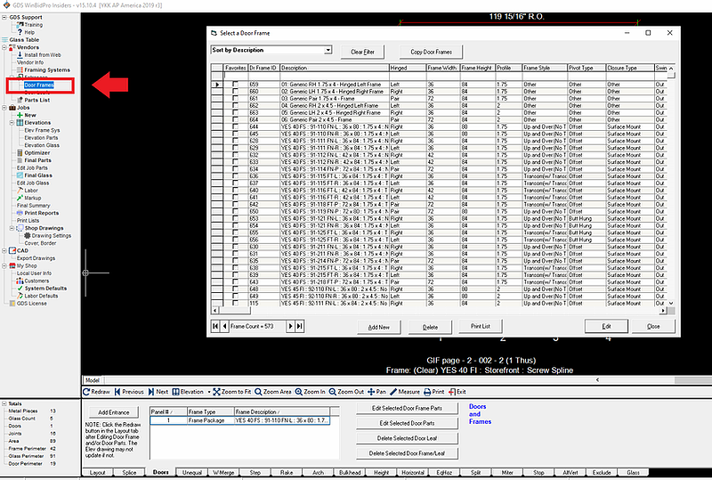
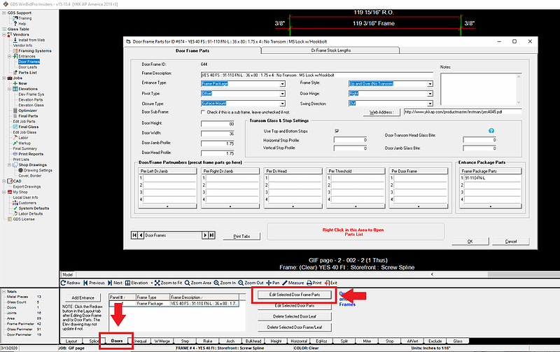
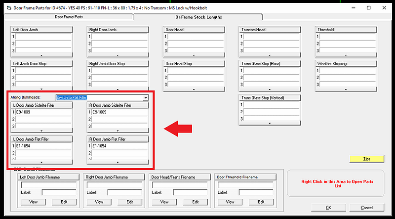
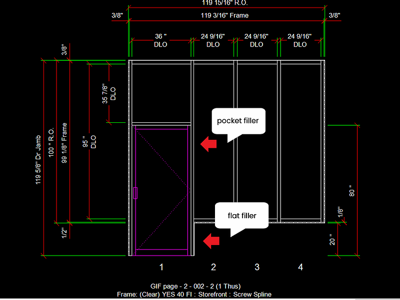
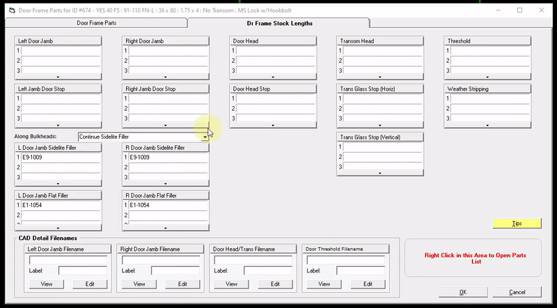
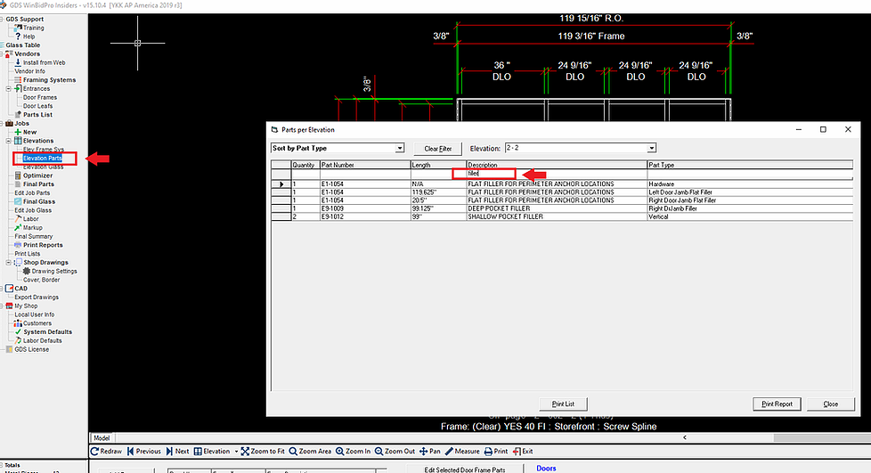

#### Learn how to configure flat fillers and pocket fillers for door jambs when adding a bulkhead

---

WinBidPro v15.10 allows you to decide whether to have a door jamb sidelite/pocket filler extend along a bulkhead, or to switch to a flat filler along the bulkhead. Below is an example elevation we will use to configure these settings.

You can configure these settings in the Door Frame Parts window.

---

## Applying Door Frame Settings to the Current Job vs All Future Jobs & Elevations

:::important
Opening `Door Frames` from the menu on the left will apply all changes made to future jobs and elevations but **not the current elevation**.
:::

:::important
Opening `Edit Selected Door Frame Parts` from the `Doors` tab at the bottom will apply all changes made to the current elevation only, and **not future jobs and elevations**.
:::

---

## Flat & Pocket Filler Settings

The settings for flat & sidelite fillers can be entered in this section here. Be sure to enter the part numbers for the pocket & flat fillers if they aren't already there.

In the example elevation below, we will choose to have a flat filler along the bulkhead rather than the pocket filler continuing down.

To do this, choose `Switch to Flat Filler` and click OK.

We can confirm the changes we made by checking the Elevation Parts window. Note that there is a pocket filler and a flat filler calculated for the right door jamb.
:::tip
type "filler" under description to filter for parts with the word "filler" in their description)
:::

