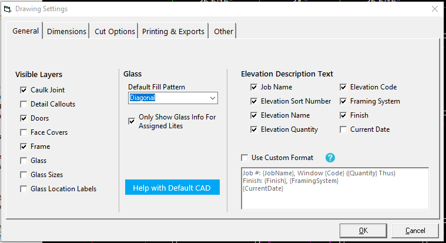

### Customizing your elevation descriptions

You can customize the description that appears under your elevations from within the Drawing Settings window.

1. Open the `Drawing Settings` window from the menu tree on the left.

2. Under the `General` tab, go to the section labeled `Elevation Description Text` on the right.

3. Check the `Use Custom Format` box and enter the description as you would like it to appear.



The parts of the description that can change are called variables. These variables are surrouneded by curly braces like `{ElevationName}`.


WinBidPro supports the following variables:

```
{JobName}       - The name of the job as shown in the jobs list
{ElevationName} - The full name of the elevation
{Code}          - The reference code assigned to the elevation
{FramingSystem} - The full description of the framing system
{Finish}        - The finish of the material
{SortNumber}    - The sort number
{Quantity}      - The quantity
{CurrentDate}   - The current date in a format like 1/15/2021
```