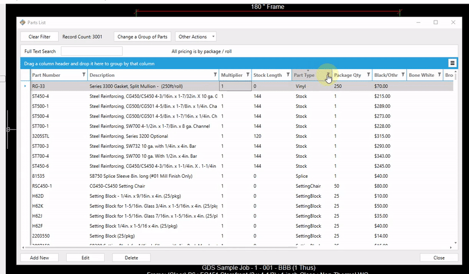

Changing price multipliers for a group of parts has become simpler than ever with the recently updated sorting capabilities in the Parts List.

The first step in changing a group of parts is sorting the parts list to find the group of parts you want to modify.

---

## Sorting the Parts List

Clicking any one of the columns at the top of the parts list will sort the list by that column. Below the list is sorted by `Part Type'.

:::tip
You can hold the shift key and click additional columns to sort by multiple columns.
:::

In this guide we will change the multiplier for all extrusions, but you can sort the parts list for any group of parts (e.g. gaskets, screws, any part with a specific stock length, any part with the word "filler" in the description, etc.). 

To show only extrusions:
1. Click the filter icon in the `Part Type` column.
2. In the drop-down menu, click the box next to `Extrusions`

Now the parts list will display all parts with "Extrusion" as their part type.

---

## Bulk Editing a Group of Parts

Once the parts list is sorted and you have narrowed down the group of parts you want to edit, click `Change a Group of Parts`. This will open the Bulk Edit window.

To change the multiplier, check the box at the right of the multiplier row, then enter the new value.

Click `Save`. The "Save" button shows how many parts you are changing.

Now in the parts list, you will see that the "Multiplier" column is updated with the new value.

