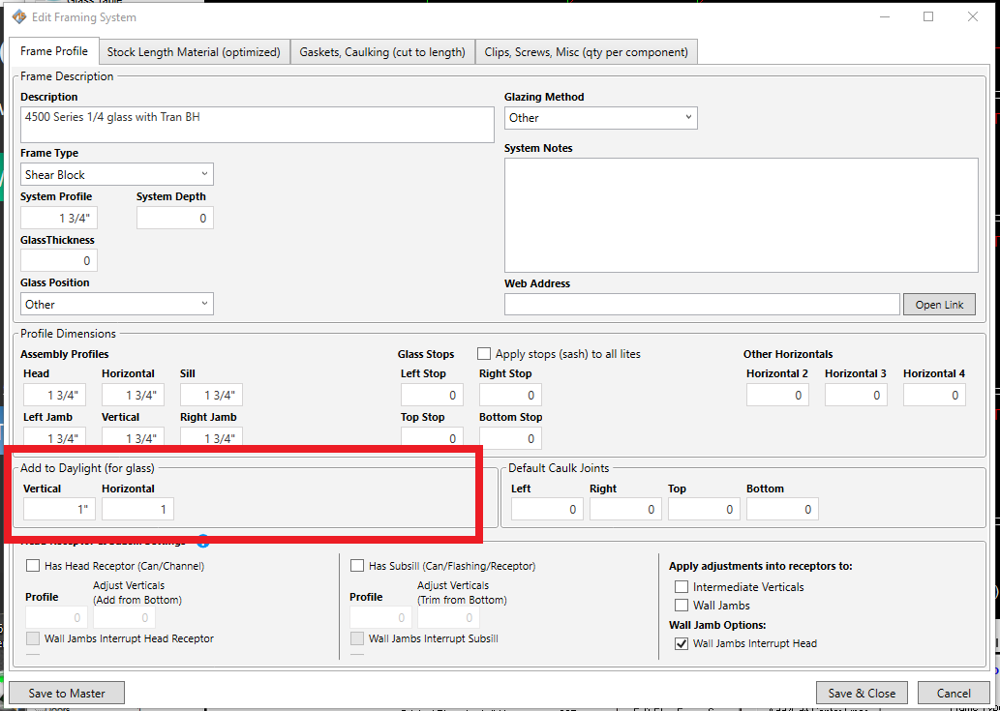
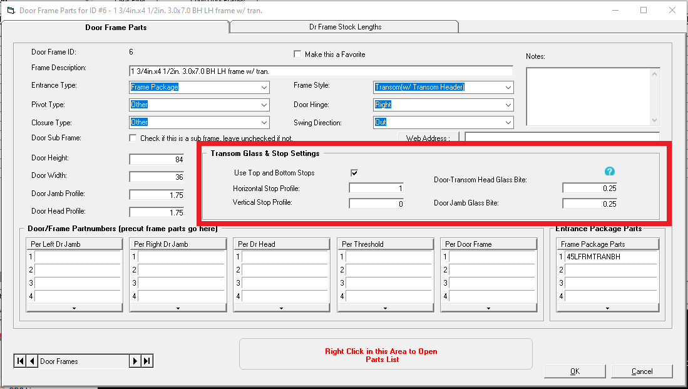
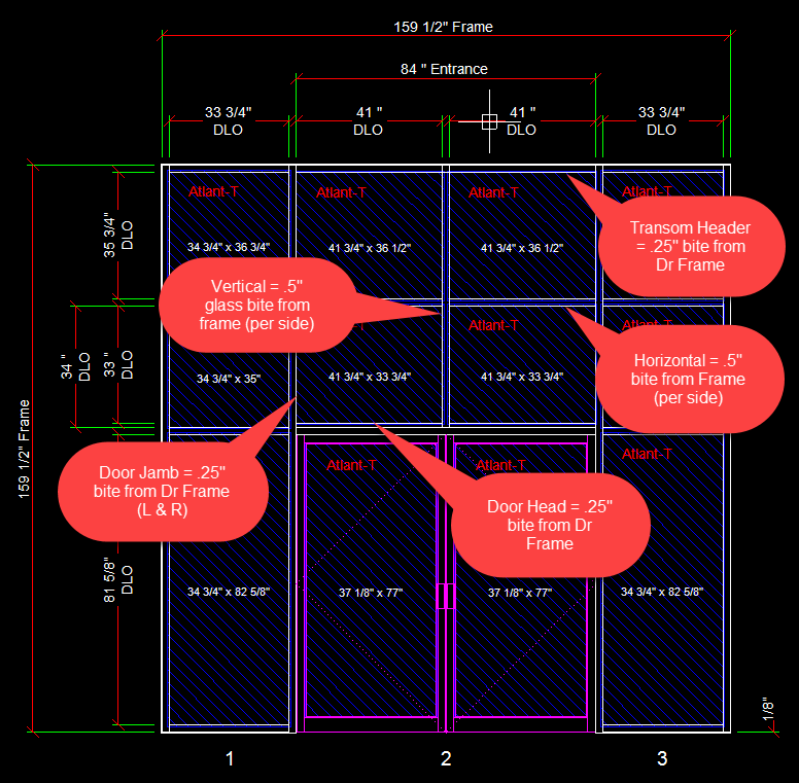

### How Frame add-to-daylight and Transom glass bite is used

Transom glass adjustments in WinBidPro have been updated in v15.8.x and though we have provided more power and flexibility in this area, it does warrant a detailed exaplanation to understand it fully.

 

The example below illustrates which frame members use which add-to-daylight values based on the settings you see below. Here is a breakdown of what the program is doing.

---

1. In the Framing System Parts window there are "add-to-daylight" settings for all standard framing members. These values represent an addition to the total width and height of glass based on the DLO. Think of this as the sum of the glass bite on each side of the glass.

2. In the Door Frame Parts window there are values for the "Door-Transom Head" and "Door Jamb" glass bite. These values represent the amount of add-to-daylight for each of these door frame members. These are the individual values, so the program will add them up to determine the glass size.

3. The program knows which frame or door frame member is touching a piece of glass, so it decides what glass bite to apply to a given member. The screen shot below illustrates this with a transom that has a split vertical mullion, and horizontals above the door.
​

4. In this example the door header with the glass stop is using the .25" glass bite to add to the height of the lites directly above the door. This comes from the Door Frame Parts window. However, the horizontal divding the transom lites receives a .5" glass bite. This is half of the 1" setting in the Framing System Parts window. So the transom glass directly above the door is .75" taller than the DLO.
​

5. The width of the transom glass in this case is calculated by using the .25" glass bite at the door jambs and the .5" glass bite at the vertical splitting the transom, also giving a .75" add to DLO.

---

#### Here is what would happen in a simple transom with one lite of glass.

1. A simple transom with no mullions would take the glass bite from both door jambs defined in the Door Frame Parts window and add them to the DLO for the width of the glass -- in this case a .5" add-to-daylight

2. The height of the glass would be a .25" add for the door head, and a .5" add for the transom head for a total of .75" add for the height of the transom glass.

3. One other possiblity is if the Door Frame Parts window had 0 for the Glass Bite values. In this case the program would automatically use the framing system add-to-daylight settings for the transom glass.
