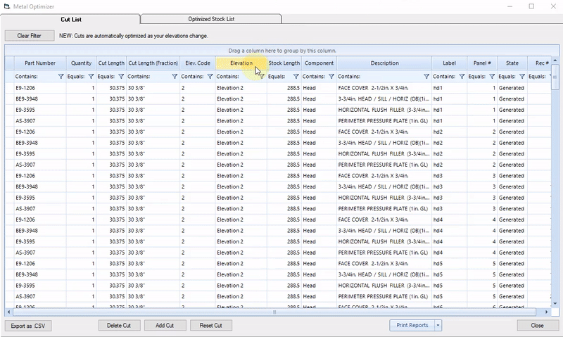

Optimize cuts and stock lengths to save on material costs.

---

## Introduction

### Opening the Optimizer
Head over to the left menu and click `Optimizer` under the `Jobs` tab.

### Cut List Tab
In the Cut List you can see every cut required for your current job.
You can add, delete, or modify existing cuts here.

### Optimized Stock List Tab
In the Optimized Stock List Tab you can see every stock length that your cuts will be made from.

You can add or delete stock lengths here.

---

## Sorting the Cut and Stock Lists

### Sorting by Column
The cut list can be sorted by any column in ascending ​or descending order​.

 
To do this, click the column you want to sort by. The cut list will be sorted in ascending or descending order indicated by the black arrow above the column name.
​

You can also sort by multiple columns by Shift+Clicking additional columns

### Sorting with Filters
You can also sort the cut list by filtering any column based on a criteria.

​
For example, you can show all cuts with part numbers containing the letters "AS"

### Grouping by Column
Another new feature of the Optimizer is the ability to group cuts by column for a more simplified view of the cut list.
​

For example you can group by Elevation by dragging that column to the section above.

---

## Adding and Modifying Cuts

### Adding a Cut
To add a cut to the cut list,

1. Click `Add Cut` button at the bottom of the Optimizer window
2. In the pop-up window, choose a part then click `Select Part`
3. Specify a quantity and cut length
4. Click `Add to Cut List`.

 
Cuts that have been added manually will be blue in the cut list. They will also be classified as `Added` under the `State` column.

### Modifying a Cut
You can modify a cut by either changing its quantity, its cut length, or its elevation code. In this example we change the quantity of a cut.

​
To do this, click the field you would like to modify, type in a new value then hit the Enter key.

 
Modified cuts will be bolded in the cut list, and will be classified as `Modified` under the `State` column.

### Deleting a Cut
​

To delete a cut, highlight the cut and click `Delete Cut` at the bottom of the Optimizer Window.
 

Deleted cuts will be grayed out in the cut list, and will be classified as `Modified` under the `State` column.

### Reset a Cut
If you want to reset modifications that have been made to a cut, highlight the cut then click `Reset Cut` at the bottom of the Optimizer window.

### Sort Cut List by Modifiied Cuts
To view all cuts that have been added, deleted, or modified, click the `State` column.

your modified cuts will appear at the top of the cut list if sorted in descending order, and at the bottom of the cut list if sorted in ascending order.

