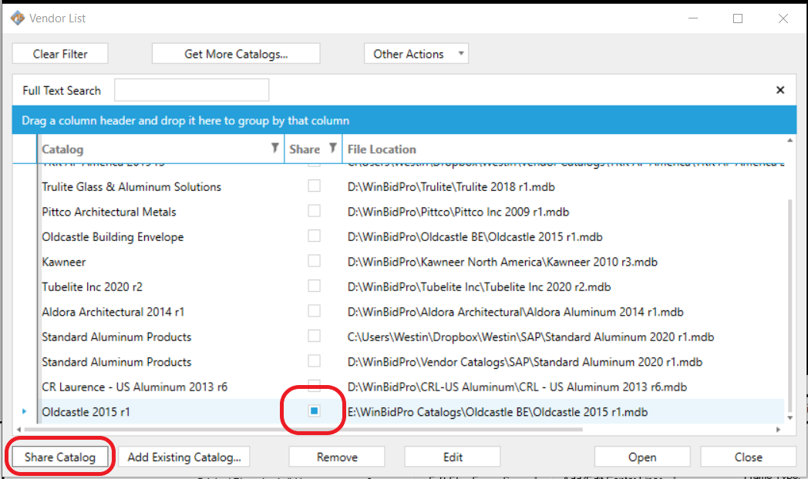

Placing catalogs/jobs on a network drive will allow multiple people on your team to work on a job simultaneously. This will save your team the trouble of having to export and send a job to another user each time a change is made.

:::important

It is important to note the difference between a network/server drive, and a cloud drive such as Google Drive or Dropbox. Placing catalogs on Google Drive or Dropbox will not allow multiple users to work on the same job simultaneously. The following process will only work if catalogs are placed onto a network/server drive.

:::

---

### Step 1

Locate your Master.mdb & Hardware2.mdb files.

:::note

Unless you performed a fresh install of WinBidPro as of version 15.10 or later, your Master.mdb and Hardware2.mdb files will be in your WinBidPro Installation folder in your local drive’s main directory.

If you have performed a fresh install of WinBidPro version 15.10 or later, your WinBidPro folder will be in User > Documents > WinBidPro

:::
---
### Step 2

Create a new folder on your network drive. For this example we’ll name it “WinBidPro Catalogs”.

---

### Step 3

Copy Master.mdb and Hardware2.mdb into the folder you created on your network drive.

---

### Step 4

In WinBidPro, you will need to set the new location of your Master.mdb file.
1. Click `System Defaults` in the menu on the left
2. In the System Defaults window, click `Set Location of Master.mdb`
3.  Locate and choose Master.mdb in your new folder on your network drive.

Doing this tells WinBidpro to download new catalogs into the folder that your Master.mdb file is in. Now, any time you use the `Get More Catalogs` feature, they will automatically be downloaded into the folder that your Master.mdb file is in.

---

### Step 5

If you want to share catalogs or jobs that have already been used or are currently being used, copy them from the WinBidPro folder on your local drive onto the new folder on your network drive.

1.  Locate the vendor catalogs in the WinBidPro folder on your local drive. (They will be in the same folder that your Master.mdb and Hardware2.mdb files were originally located).

2. Copy your catalogs and paste them into the new folder on your network drive. For this example we will copy over the Oldcastle catalog.

---

### Step 6

In WinBidPro, we now need to set the new location of the catalogs on the network drive.

1. Click `Vendors` in the menu on the left
2. Click `Add Existing Catalog` and choose the .mdb file of whichever catalog you are adding.

Now we can see the file location for the Oldcastle catalog is set to the network drive.

---

### Step 7

The final step is to let WinBidPro know which catalogs will be shared. To do this, click the catalog that you will be sharing, then click `Share Catalog`. We can now see that the box in the “Shared” column is highlighted.

:::note
The other users who will be sharing the catalogs will have to set the location of the Master.mdb file to the network drive, and add the catalogs from the network drive as well. Refer to steps 4-7.
:::